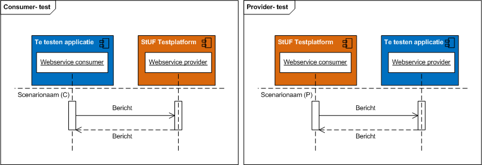

# Compliancy Betalen- en Invorderenservices

|   |   |
| --- | --- |
| Testsetversie: | 1.1 |
| Status | In gebruik |
| Datum laatst gewijzigd | 19 mei 2015 |

## Revisie historie

| Versie | Datum | Reden en aard wijziging |
| --- | --- | --- |
| 1.0 | 01-07-2014 | - |
| 1.1 | 25-11-2014 | CCorrectief onderhoud;Herindeling en naamswijziging testscenario’s t.b.v. StUF Testplatform release 1.3.0 |
| 1.2 | 19-05-2015 | Publicatie testsetbeschrijving op de gemmaonline. |

## Inleiding
De standaard [Betalen- en Invorderenservices 1.0](http://www.gemmaonline.nl/images/cocreatiebasisgemeente/9/9d/Koppelvlakspecificatie_Keten_Betalen_en_Invorderen_v1.00.pdf) is op 2 april 2014 formeel vastgesteld door de StUF Regiegroep. Daarmee heeft de standaard de status ‘In gebruik’ en wordt gemeenten aanbevolen om deze standaard te gebruiken.

Voor een juiste toepassing van de standaard Betalen- en Invorderenservices worden door VNG Realisatie compliancy instrumenten ontwikkeld met als doel interoperabiliteitsproblemen tussen applicaties bij gemeenten preventief te verminderen. In de paragraaf 2.1 ”Wanneer is een softwareproduct compliant” is aangegeven wanneer een softwareproduct compliant is aan de Betalen- en Invorderenservices 1.0.

VNG Realisatie adviseert gemeenten bij aanschaf van software die moet voldoen aan deze standaard gebruik te maken van de [Handreiking leverings- en acceptatievoorwaarden ICT](./documenten/130131_Leverings_en_acceptatievoorwaarden_versie_2_Definitief.pdf). Daarin zijn voorwaarden opgenomen over het gebruik van compliancy instrumenten.

Op 7 mei 2014 heeft VNG Realisatie de technische professionals van leveranciers tekst en uitleg gegeven over het deze testset en het gebruik van het StUF Testplatform. Onderliggend document maakt deel uit van de compliancy instrumenten van VNG Realisatie.

## Doel van document
Doel van dit document is het definiëren van een standaard testset voor het testen van koppelingen die gebaseerd zijn op de Betalen- en Invorderenservices 1.0. Deze testset beschrijft de tests die minimaal voorafgaand aan het in productie nemen van (aangepaste of nieuwe) software door de betreffende softwareleverancier uitgevoerd moeten worden.

De testen dienen uitgevoerd te worden conform deze beschrijving en met behulp en conform de voorwaarden van het StUF Testplatform. Voor gebruik van deze testset is een abonnement nodig op het StUF Testplatform nodig. Organisaties dienen zich, voor zover ze nog geen abonnement hebben, aan te melden. Zie: [StUF Testplatform](https://www.stuftestplatform.nl)

Indien voldaan wordt aan alle compliancy eisen uit kan de betreffende leverancier aangeven dat het geteste softwareproduct compliant is aan de Betalen- en Invorderenservices 1.0.

## Wanneer is een softwareproduct compliant
Een softwareproduct is compliant aan de Wabo-BAG Services 1.0 (*), indien aan alle onderstaande vijf eisen wordt voldaan:

| Nr  | Eis |
|---- |---- |
| 1	  | Het betreffende softwareproduct getest is conform de eisen en voorwaarden uit onderliggende document inclusief de bijlagen en |
| 2	  | De uitvoering heeft plaatsgevonden op en conform de voorwaarden van het StUF testplatform en |
| 3	  | Een foutloos testresultaat is behaald en |
| 4	  | Finale en authentieke testrapporten openbaar zijn gemaakt op het internet en |
| 5	  | In de [GEMMA softwarecatalogus](https://www.softwarecatalogus.nl/) heeft u het authentieke testrapport uit stap 4 gepubliceerd bij het betreffende softwareproduct en aangegeven (aangevinkt) dat u compliant bent. |

(*) Hoewel een foutloos testresultaat van deze testset geen absolute zekerheid geeft van 100% interoperabiliteit tussen applicaties, geeft dit wel een goede indicatie van de kwaliteit van de ondersteuning van de standaard.

## Specificatie van testset
Leveranciers van gemeentelijke software dienen koppelingen te leveren die volledig voldoen aan de standaard. Afhankelijk van de GEMMA referentiecomponent(en) die een softwareproduct invult binnen het toepassingsgebied van de standaard, stelt de standaard andere eisen. Daardoor is de testscope niet voor alle applicaties gelijk.

## Referentiecomponenten
De specificatie stelt eisen aan drie referentiecomponenten. Dit zijn:

* Taakspecifieke applicatie (TSA): de applicaties waar Invorderingen voor de gemeenten uit ontstaan. Dit betreft zowel Backoffice applicaties als een zaaksysteem waarin bijvoorbeeld vergunningen worden afgegeven.
* Inningensysteem: Systeem voor ondersteuning van het innen, invorderen en kwijtschelden van publiekrechtelijke en eventueel privaatrechtelijke vorderingen.
* Financiële applicatie: Systeem voor financieel management, administratie en budgetbeheersing.

## Procesinteracties en systeemcomponenten
Onderstaand overzicht beschrijft het applicatielandschap met de te standaardiseren proces- en systeeminteracties. De processtappen zijn verder uitgewerkt in het [Koppelvlakspecificatiedocument](documenten/Koppelvlakspecificatie_Keten_Betalen_en_Invorderen_v1.00.pdf) dat in april 2014 is opgeleverd.

## Consumer en provider testen
Bij elke test is middels een P of C aangegeven of het een Provider of Consumer test betreft. Bij een provider test moet de te testen applicatie een service beschikbaar stellen aan het StUF Testplatform; het StUF Testplatform zal één of meerdere berichten versturen naar de te testen applicatie. In geval van een consumer test levert het StUF Testplatform een service aan de te testen applicatie. De te testen applicatie moet in deze gevallen één of meerdere berichten versturen naar het StUF Testplatform. Afhankelijk of een test een provider of consumer test is verwacht het StUF Testplatform dus een bericht van de te testen applicatie of verstuurt het StUF Testplatform een bericht naar de te testen applicatie.

In de volgende paragrafen wordt per referentiecomponent/rol(*) beschreven welke testen uitgevoerd moeten worden, de testscope. Indien een softwareproduct invulling geeft aan meerdere referentiecomponenten dan is de testscope voor het softwareproduct gelijk aan de gezamenlijke testscope van alle ingevulde referentiecomponenten. Bijvoorbeeld, als een softwareproduct zowel de functionaliteit levert van de referentiecomponent Zaaksysteem als van een Document Management systeem, dan dienen zowel de testen van het referentiecomponent Zaaksysteem als Document Management systeem uitgevoerd te worden.

*Een rol kan gezien worden als een groep van referentiecomponenten die dezelfde generieke functionaliteit bieden. Een voorbeeld hiervan is de Zaakservice consumer. Indien een softwareproduct de rol van Zaakservice consumer invult dan betekent dit dat in dit softwareproduct zaakgerelateerde informatie ontstaat of wordt aangepast en dat deze informatie volgens de services uit de Zaak- en Documentservices wordt ontsloten naar een Zaaksysteem. Vrijwel elk softwareproduct kan de rol van Zaakservice consumer invullen. Denk aan vergunningsystemen, handhavingssystemen, uitkeringensysteem etc.

## Testscope: Taakspecifieke Applicatie
Indien een softwareproduct invulling geeft aan de referentiecomponent taakspecifieke applicatie, dan moet op het StUF Testplatform de testset Betalen en Invorderen services uitgevoerd worden voor de referentiecomponent taakspecifieke applicatie.

De Betalen en Invorderen services beschrijven voor een taakspecifieke applicatie naast verplichte ook optionele services. Afhankelijk of een taakspecifieke applicatie deze services implementeert moeten bepaalde testscenario’s verplicht uitgevoerd worden. Services welke volgens de standaard voor het betreffende referentiecomponent als optioneel worden aangemerkt zijn als zodanig ook als optioneel testscenario geïmplementeerd in het StUF Testplatform. Het StUF Testplatform biedt de functionaliteit om deze optionele testscenario's per testset uitvoering aan -of uit de zetten.

Tijdens de testset uitvoering mogen geen fouten geconstateerd worden door het StUF Testplatform.

Tijdens de testuitvoering simuleert het StUF Testplatform een Inningensysteem applicatie. Er worden berichten naar het te testen softwareproduct gestuurd waarin zowel verplichte als optionele elementen voorkomen. Tijdens de testuitvoering worden de volgende services getest:

1. Verstrek vordering (C)
2. Verstrek Vorderingstatus (C)
3. Verstrek vorderingstatus wijziging (P)

Als de taak specifieke applicatie documenten opslaat in een extern DMS of zaakinformatie opslaat in een zaaksysteem dan moet dit gebeuren volgens de zaak- en documentservices 1.0 standaard. Vanuit de Zaak- en documentservices 1.0 vult de taak specifieke applicatie daarmee de rol in van zaakservice consumer en/of documentservice consumer. In de zaak- en documentservices testset staat beschreven welke testscenario’s voor deze rol(len) verplicht uitgevoerd moeten worden. De verplichte testscenario’s behoren de testscope van de taak specifieke applicatie.

## Testscope Inningensysteem
De Betalen en Invorderen services beschrijven voor een inningensysteem naast verplichte ook optionele services. Afhankelijk of een taak specifieke applicatie deze services implementeert moeten bepaalde testscenario’s verplicht uitgevoerd worden. Services welke volgens de standaard voor het betreffende referentiecomponent als optioneel worden aangemerkt zijn als zodanig ook als optioneel testscenario geïmplementeerd in het StUF Testplatform. Het StUF Testplatform biedt de functionaliteit om deze optionele testscenario's per testset uitvoering aan -of uit de zetten.

Tijdens de testset uitvoering mogen geen fouten geconstateerd worden door het StUF Testplatform.

Tijdens de testuitvoering simuleert het StUF Testplatform een Taakspecifieke applicatie en Financiële administratie. Er worden berichten naar het te testen softwareproduct gestuurd waarin zowel verplichte als optionele elementen voorkomen. Tijdens de testuitvoering worden de volgende services getest:

1. Verstrek vordering (P)
2. Verstrek Vorderingstatus (P)
3. Verstrek vorderingstatus wijziging (C)
4. Verstrek Financiële verantwoording (C)

Als het inningensysteem documenten opslaat in een extern DMS of zaakinformatie opslaat in een zaaksysteem dan moet dit gebeuren volgens de zaak- en documentservices 1.0 standaard. Vanuit de Zaak- en documentservices 1.0 vult het inningensysteem daarmee de rol in van zaakservice consumer en/of documentservice consumer. In de zaak- en documentservices testset staat beschreven welke testscenario’s voor deze rol(len) verplicht uitgevoerd moeten worden. De verplichte testscenario’s behoren de testscope van het inningensysteem.

Indien het inningensysteem niet rechtstreeks een basisregistratie bevraagt voor natuurlijke en niet-natuurlijke persoonsgegevens dan moet het inningensysteem deze gegevens opvragen uit een gegevensmagazijn via services uit de Prefill eFormulier services standaard. Vanuit de Prefill eFormulier services 1.0 vult het inningensysteem daarmee de rol in van E-formulieren Applicatie. In de Prefill eFormulier services testset staat beschreven welke testscenario’s voor deze rol verplicht uitgevoerd moeten worden.

## Testscope: Financiële Administratie
Indien een softwareproduct invulling geeft aan de referentiecomponent Financiële Administratie dan moet op het StUF Testplatform de testset Betalen en Invorderen services uitgevoerd worden voor de referentiecomponent Financiële Administratie.

Tijdens de testuitvoering simuleert het StUF Testplatform een Inningensysteem. Er worden berichten naar het te testen softwareproduct gestuurd waarin zowel verplichte als optionele elementen voorkomen. Tijdens de testuitvoering worden de volgende services getest:

1. Verstrek Financiële verantwoording (P)

## Bericht varianten
Voor elk testscenario geldt dat de services worden getest met een minimale en maximale variant van een bericht.

De maximale variant van een bericht bevat alle door de standaard verplichte en optionele elementen, voorzien van een volgens het RSGB/RGBZ geldige waarde waarbij gerelateerde elementen maximaal twee keer voorkomen en maximaal maximaal twee niveau’s diep (gerelateerde van een gerelateerde)

De minimale variant van een bericht bevat alleen de verplichte elementen, voorzien van een volgens het RSGB/RSGZ geldige waarde waarbij gerelateerde (verplichte) elementen maximaal 1 keer voorkomen.

## Beschrijving testset scenario’s
De testscenario’s behorende bij deze testset zijn beschreven in een [spreadsheet](documenten/Testset_betalen_en_Invorderen_1.0.zip).

Per referentiecomponent/rol is een tabblad opgenomen waar u de testscenario’s vindt die relevant zijn voor softwareproducten die deze referentiecomponent/rol invullen. Een testscenario beschrijving bestaat uit een sequence diagram (in UML) en een tabel waarin wordt toegelicht welke acties uitgevoerd moeten worden en wat daarbij het resultaat moet zijn.

Afbeelding 2: voorbeeld scenariobeschrijving

Het sequence diagram geeft aan in welke volgorde de berichten verstuurd moeten worden door het StUF Testplatform of de te testen applicatie. De rode bolletjes geven de scenariostappen weer.

Afbeelding 3: voorbeeld sequence diagram

## Gebruik van het StUF Testplatform
Het StUF Testplatform is een onafhankelijk en formeel toetsinginstrument voor het testen van koppelingen gebaseerd op standaarden uit de StUF familie. Het platform is vanaf eind 2011 in productie en wordt beheerd en doorontwikkeld door VMG Realisatie.

Primair is het StUF Testplatform voor ICT softwareleveranciers die werkzaam zijn op de gemeentelijke markt. Zij kunnen vroegtijdig tijdens de ontwikkeling van software testen of applicatie-applicatiekoppelingen voldoen aan StUF. Leveranciers worden geacht een (preventieve) test uit te voeren op het StUF Testplatform voordat een softwareproduct in productie wordt genomen.

In de [handleiding StUF Testplatform](./documenten/Gebruikershandleiding_StUF_Testplatform.pdf) wordt verder toegelicht hoe het testplatform gebruikt kan worden.
