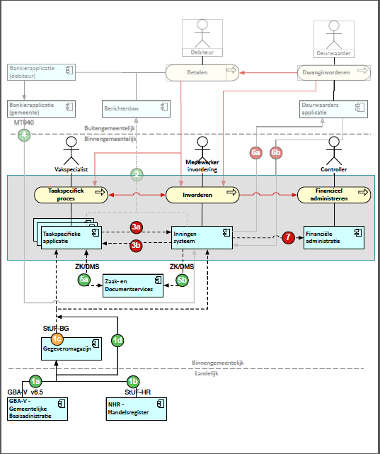

# Techniek Betalen- en Invorderenservices

## Referentiecomponenten
De specificatie stelt eisen aan drie referentiecomponenten. Dit zijn:

* Taakspecifieke applicatie (TSA): de applicaties waar Invorderingen voor de gemeenten uit ontstaan. Dit betreft zowel Backoffice applicaties als een zaaksysteem waarin bijvoorbeeld vergunningen worden afgegeven.
* Inningensysteem: Systeem voor ondersteuning van het innen, invorderen en kwijtschelden van publiekrechtelijke en eventueel privaatrechtelijke vorderingen.
* Financiële applicatie: Systeem voor financieel management, administratie en budgetbeheersing.

## Procesinteracties en systeemcomponenten
Onderstaand overzicht beschrijft het applicatielandschap met de te standaardiseren proces- en systeeminteracties. De processtappen zijn verder uitgewerkt in het [Koppelvlakspecificatiedocument](documenten/Koppelvlakspecificatie_Keten_Betalen_en_Invorderen_v1.00.pdf) dat in april 2014 is opgeleverd.

